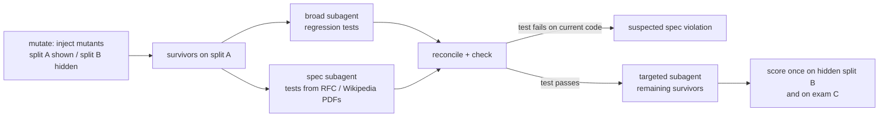

# MutantHunter

**MutantHunter finds the bugs a test suite misses, writes tests that catch them, and proves the gain on mutants the agents never saw.** It is an IBM Bob skill plus a deterministic Python harness, built with IBM Bob for the lablab.ai IBM Bob 2.0 Hackathon.

## Links

- **Dashboard**: [`docs/index.html`](docs/index.html), live on GitHub Pages: https://hanlinji4002.github.io/MutantHunter/
- **Slides**: [`docs/slides/MutantHunter_slides.pdf`](docs/slides/MutantHunter_slides.pdf)
- **Demo video**: link added at submission
- **Statements**: [`docs/problem_solution.md`](docs/problem_solution.md), [`docs/bob_usage.md`](docs/bob_usage.md)
- **Bob sessions**: [`bob_sessions/`](bob_sessions/), 22 exported tasks with screenshots

## Contents

- [The problem](#the-problem)
- [How it works](#how-it-works)
- [Results](#results)
- [Bugs found](#bugs-found)
- [How IBM Bob was used](#how-ibm-bob-was-used)
- [Repository layout](#repository-layout)
- [Reproduce](#reproduce)
- [Limits and threats to validity](#limits-and-threats-to-validity)

## The problem

Coverage says a line ran; it does not say a test would notice if that line were wrong. In [python-validators](https://github.com/python-validators/validators), `url.py` has 91.9% line and branch coverage, yet the human tests kill only 35 of 58 small injected bugs (mutants). Across the 10 weakest modules, 155 of 481 mutants survive.

Asking an AI assistant to "write more tests" helps, but a plain prompt writes tests that pin down whatever the code does today, including its bugs.

## How it works



One sentence in Bob (`Use the mutant-hunter skill on the module url.`) runs the whole procedure in [`.bob/skills/mutant-hunter/SKILL.md`](.bob/skills/mutant-hunter/SKILL.md):

1. `mutanthunter mutate` injects mutants into an isolated copy of the module and runs the human tests. Only split A (half of the mutants, chosen by a seeded hash) is ever shown to agents.
2. Two subagents run **in parallel**: a *broad* one writes the tests a careful developer would write; a *spec* one reads the module's specification (RFC, ISO or Wikipedia PDF), writes numbered rules, and derives expected results from the spec, not from the code.
3. `mutanthunter check` runs every new test. A test that fails on the current code is never deleted: it becomes a **suspected spec violation** with a category (logic, data-staleness, spec-ambiguous, human-test-conflict).
4. A *targeted* subagent attacks the split-A survivors that are still alive (skipped when Bobcoins are tight).
5. After generation is frozen, the tests are scored once on the hidden split B and on **exam C**, a set of mutant operators that did not exist while the tests were written.

The core package (`mutant_hunter/`) is deterministic and never calls an LLM. It guards against three silent failures of mutation testing: editable installs that test the wrong copy, red baselines, and stale bytecode.

Suites: **B0** = human tests, **B1** = human tests + one plain Bob prompt per module (no subagents, skill or rules), **MH** = human tests + MutantHunter.

## Results

6 modules were run: 4 `main` (url, finance, cron, email) and 2 `extra` (hostname, mac_address). Full tables: [`results/stats.md`](results/stats.md), [`results/summary.csv`](results/summary.csv).

**Hold-out split B, main modules (141 mutants)**

| Suite | Killed | Score (95% CI) |
|---|---|---|
| B0 human | 85 | 60.3% (52.0–68.0%) |
| B1 plain prompt | 109 | 77.3% (69.7–83.4%) |
| MH | 110 | 78.0% (70.5–84.1%) |

McNemar B1 vs MH: 2 mutants killed only by B1, 3 only by MH, p = 1.00. **On split B, MH and B1 tie.**

**Exam C, unseen operators, main modules (146 mutants)**

| Suite | Killed | Score (95% CI) |
|---|---|---|
| B0 human | 96 | 65.8% (57.7–73.0%) |
| B1 plain prompt | 112 | 76.7% (69.2–82.8%) |
| MH | 120 | 82.2% (75.2–87.5%) |

McNemar B1 vs MH: 1 only by B1, 9 only by MH, p = 0.0215. We ran four McNemar tests (split B and exam C, main and extra); after a Bonferroni correction this is not significant, so we read it as a trend: spec-derived tests may generalise better to unseen kinds of bugs.

**Extra modules**: 17/19 for all three suites on split B; 14/33 (B0), 25/33 (B1), 26/33 (MH) on exam C.

**Split A, before → after (human → human+MH)**: url 53.1% → 65.6%, finance 68.9% → 82.0%, cron 58.1% → 74.2%, email 81.8% → 90.9%, hostname 83.3% → 83.3%, mac_address 80.0% → 80.0% (their only split-A survivors are equivalent mutants).

**Historical bug replay** ([`results/replay.csv`](results/replay.csv)). Each fix commit is reverted and the tests are run on the pre-fix and fixed code. The meaningful rows are the two `extra` bugs that today's human tests still miss:

| Bug | Human | MH | B1 |
|---|---|---|---|
| `402b351` mac_address accepted mixed `:`/`-` separators | miss | caught | caught |
| `41f3d6d` hostname rejected single-character labels | miss | caught | caught |

On the 8 `main` rows of url and email (7 fixes; the spec-ambiguous row `1231f6a` excluded) human 7/8, MH 7/8, B1 5/8; these are context only, because tests written today encode today's fixed behaviour.

**Cost**: the 6 MutantHunter runs used 37.5 Bobcoins (median 6.1 per module, median 9.2 minutes); the 6 B1 prompts used 2.9 Bobcoins. MH costs about 13 times more than a plain prompt.

## Bugs found

The spec subagents logged 13 suspected violations. We reviewed each by reading the code and searching the upstream issues: 9 entries confirmed (5 distinct bugs), 4 rejected as design choices. All 5 bugs are still present on upstream `master` (checked 2026-09-26). Details: [`results/suspected_bugs/`](results/suspected_bugs/).

| Bug | Code | Upstream |
|---|---|---|
| ISIN check digit is never verified: `_isin_checksum` computes each value but never adds it to `check`, so any check digit passes (`US0378331006`) | `src/validators/finance.py:34-51` | known, [#440](https://github.com/python-validators/validators/issues/440) (open) |
| A single-label hostname is capped at 61 characters; RFC 1123 requires 63 | `src/validators/hostname.py:27-29` | not reported |
| Email: the RFC 5321 literal `user@[IPv6:::1]` is rejected, while the non-standard `user@[::1]` is accepted | `src/validators/email.py:70` | not reported |
| Email: a quoted local part with a space or `@` (`"user name"@example.com`) is rejected | `src/validators/email.py:58`, `:93-95` | not reported |
| URL with an empty port (`http://example.com:`) is rejected; RFC 3986 and WHATWG allow it | `src/validators/hostname.py:18-21` | not reported |

Rejected: single-character TLD, dotted MAC notation, port 0, and `strict_query` (library policy choices).

The plain B1 prompt did the opposite: in `finance` it noticed the broken ISIN check and wrote tests around it; in `email` it asserted that a quoted local part with a space must be rejected.

## How IBM Bob was used

Two team members used Bob in 22 tasks (Evan 8, chu 14), about 88.4 Bobcoins in total. Every task is exported in [`bob_sessions/`](bob_sessions/) with a screenshot of its cost; the full statement is [`docs/bob_usage.md`](docs/bob_usage.md).

- **Planning**: in Plan mode, Bob turned the design ([`docs/SPEC.md`](docs/SPEC.md)) into the build plan [`docs/track-a-plan.md`](docs/track-a-plan.md); before coding the harness it wrote [`docs/mutanthunter-core-plan.md`](docs/mutanthunter-core-plan.md).
- **Agent mode**: Bob wrote all product code (harness, skill, rules, statistics, dashboard, replay, exam C, Windows port), the 128 unit tests and all generated tests, apart from the small edits listed below.
- **Skills, rules and parallel subagents**: the `mutant-hunter` skill and [`.bob/rules/testing.md`](.bob/rules/testing.md); 13 subagents across 6 runs.
- **Document understanding**: 10 specification PDFs turned into 137 numbered rules that the spec tests cite.

**Work outside Bob.** The team reviewed the 13 suspected violations by hand (reading the code, searching upstream issues) and recorded the verdicts, corrected the cron test count in `results/modules/cron.json` (a subagent stopped with an error and its files were missed in the summary), and restyled the dashboard page (IBM colour theme, Source Serif 4 and IBM Plex fonts, charts) without changing how any number is computed.

## Repository layout

```
MutantHunter/
├── mutant_hunter/                      deterministic harness and mutanthunter CLI (no LLM calls)
│   ├── registry.py, isolation.py       module registry; isolated copies with the silent-failure guards
│   ├── mutate.py, check.py             operators, seeded A/B split, parallel runs; check one test file
│   ├── exam_c.py, replay.py            exam C operators; historical bug replay
│   ├── stats.py, report.py             Wilson CI, exact McNemar; summary.csv, stats.md, dashboard
│   └── cli.py, backends/base.py        CLI entry point; backend interface and cost log
├── tests/                              128 unit tests of the harness (125 fast, 3 marked slow)
├── .bob/skills/mutant-hunter/SKILL.md  the skill: one sentence runs the whole procedure
├── .bob/rules/testing.md               rules every subagent follows
├── targets/validators/                 python-validators at commit 70de324, source unchanged
│   ├── tests/mh/<module>/              tests written by MutantHunter
│   └── tests/b1/<module>/              tests written by the plain-prompt baseline B1
├── dataset/                            24 modules, 21 historical fixes, 30 spec PDFs (+ text), sources
├── results/                            mutation runs, per-module results, suspected bugs, statistics, replay
├── docs/
│   ├── index.html                      dashboard (served by GitHub Pages)
│   ├── slides/                         presentation slides
│   ├── SPEC.md                         design spec
│   ├── track-a-plan.md                 build plan written by Bob
│   ├── mutanthunter-core-plan.md       harness implementation plan written by Bob
│   ├── problem_solution.md             problem and solution statement
│   └── bob_usage.md                    IBM Bob usage statement
├── bob_sessions/                       exported Bob task histories and screenshots
└── pyproject.toml                      package mutant-hunter, console script mutanthunter
```

## Reproduce

```bash
cd targets/validators
uv venv --python 3.12 && source .venv/bin/activate
uv pip install -e ".[crypto-eth-addresses]" pytest pytest-cov
cd ../.. && uv pip install -e .

python -m pytest -q -m "not slow" tests                      # fast unit tests of the harness
mutanthunter baseline --set all --jobs 8                     # reproduces dataset/modules.csv exactly
mutanthunter mutate url --split B --suite human+mh --jobs 8  # hold-out score of one suite
mutanthunter replay --set all --suite human,mh,b1            # needs a python-validators clone in ../validators-history
mutanthunter report                                          # results/stats.md and docs/index.html
```

On Windows use `.venv\Scripts\Activate.ps1`; the harness supports both.

## Limits and threats to validity

- Bobcoin budget: 6 of the 12 planned modules (4 of 10 `main`); the targeted subagent ran only for `url`.
- On split B, MH does not beat the plain prompt; the exam C advantage is not significant after correcting for multiple tests.
- One target project, one seed (20260925), mutants from simple operators; equivalent mutants are detected automatically only for the falsy-preserving case.
- Split B was scored once, after test generation was frozen; exam C was written after the freeze and scored once. The test files did not change between the two scorings.
- Some steps were done by hand, outside Bob: see [Work outside Bob](#how-ibm-bob-was-used).

Data sources and licenses: [`dataset/SOURCES.md`](dataset/SOURCES.md). Team: Evan (plan, harness, skill; tests for url, hostname, mac_address) and chu (Windows port; tests for finance, cron, email; evaluation, dashboard, video).
