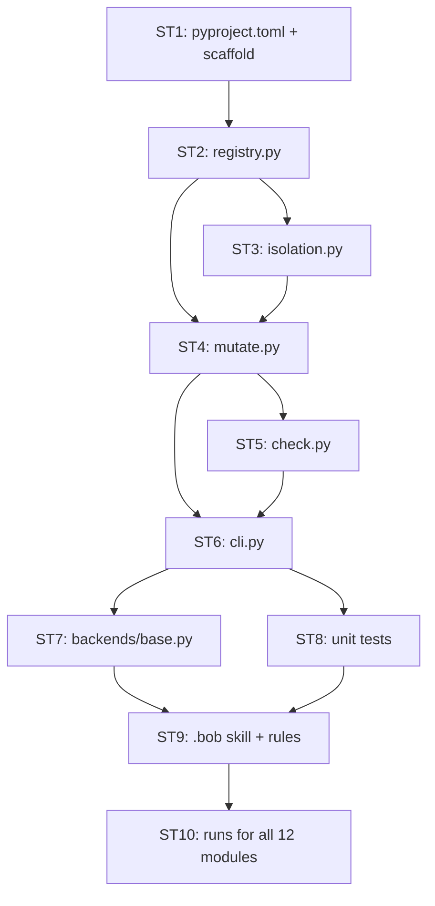

# Read @/docs/SPEC.md and @/dataset/README.md.
We work as a relay. I (track A) build the tool and generate the tests: mutant_hunter/registry.py, isolation.py, mutate.py, check.py, cli.py, backends/base.py, pyproject.toml, unit tests, .bob/skills, .bob/rules, and the mutant-hunter runs for all 12 modules with set main or extra. Then I hand the folder to my teammate (track B), who does all evaluation: B1 baseline, stats.py, report.py, replay.py, exam_c.py, split-B and exam-C scoring, and the dashboard.
Produce a build plan for my part that follows the spec exactly, and list the interfaces track B will plug into.
Do not write any code.

---

**Status:** active  **Date:** 2026-09-26

---

### 👤 User

Read @/docs/SPEC.md and @/dataset/README.md.
We work as a relay. I (track A) build the tool and generate the tests: mutant_hunter/registry.py, isolation.py, mutate.py, check.py, cli.py, backends/base.py, pyproject.toml, unit tests, .bob/skills, .bob/rules, and the mutant-hunter runs for all 12 modules with set main or extra. Then I hand the folder to my teammate (track B), who does all evaluation: B1 baseline, stats.py, report.py, replay.py, exam_c.py, split-B and exam-C scoring, and the dashboard.
Produce a build plan for my part that follows the spec exactly, and list the interfaces track B will plug into.
Do not write any code.

---

### 🤖 Assistant

> 🔧 called: use_skill

> 🔧 **use_skill** — create-plan

### 🤖 Assistant

> 🔧 called: read_file, read_file

> 🔧 **read_file** — dataset/README.md

> 🔧 **read_file** — docs/SPEC.md

### 🤖 Assistant

> 🔧 called: spawn_subagent

Now let me explore the existing repository structure to ground the plan in what already exists.

> 🔧 **spawn_subagent** — explore

### 🤖 Assistant

> 🔧 called: read_file

Now let me read the full `modules.csv` to have precise module data:

> 🔧 **read_file** — dataset/modules.csv

### 🤖 Assistant

> 🔧 called: write_file

I now have everything needed to write a thorough, grounded plan. Let me produce it.

> 🔧 **write_file** — docs/track-a-plan.md

### 🤖 Assistant

Here is the full plan.

---

## Track A Build Plan

The plan file is at [`docs/track-a-plan.md`](docs/track-a-plan.md).

---

### Build sequence

---

### The 10 sub-tasks

| # | Deliverable | Milestone | Acceptance gate |
|---|---|---|---|
| ST1 | `pyproject.toml` + `mutant_hunter/__init__.py` | M1 | `mutanthunter --help` works |
| ST2 | `registry.py` | M1 | loads CSV, computes slugs, warns on missing test dirs |
| ST3 | `isolation.py` | M1 | exit-2 / exit-3 guards, deterministic parallel results |
| ST4 | `mutate.py` | M1 | all 6 operators, stable IDs, sha256 split, `ref_match = yes` for all 24 |
| ST5 | `check.py` | M2 | JSON output per spec 5.6, flaky detection, failing tests reported |
| ST6 | `cli.py` | M1 | 6 subcommands wired, track-B stubs print stub and exit 1 |
| ST7 | `backends/base.py` | M1 | `AgentBackend` ABC, `record_cost` per-member CSV |
| ST8 | `tests/` | M1 | exit-2, exit-3, unique IDs, `--jobs` idempotence, `ref_match = yes` |
| ST9 | `.bob/skills/` + `.bob/rules/` | M2 | `url` runs end-to-end in one request; parallel subagents; split-A score up |
| ST10 | Mutation runs for all 12 modules | M3 | all 5 artefacts exist per module; `tests/mh/` and `tests/b1/` populated |

---

### The 12 target modules

| Set | Module | Slug | Ref mutants | Ref killed | Spec docs |
|---|---|---|---|---|---|
| main | `country` | `country` | 55 | 41 | 3 ISO/wiki PDFs |
| main | `cron` | `cron` | 75 | 47 | wiki-Cron |
| main | `domain` | `domain` | 24 | 17 | RFC 1034/1035/2782 |
| main | `email` | `email` | 25 | 15 | RFC 5322/5321 |
| main | `finance` | `finance` | 118 | 74 | ISIN/CUSIP/SEDOL wikis |
| main | `ip_address` | `ip_address` | 29 | 22 | RFC 791/4291/4632/5952 |
| main | `url` | `url` | 58 | 35 | RFC 3986 |
| main | `uuid` | `uuid` | 7 | 5 | RFC 9562 |
| main | `i18n/fi` | `i18n__fi` | 40 | 31 | Finnish ID/Y-tunnus wikis |
| main | `i18n/fr` | `i18n__fr` | 50 | 39 | INSEE/NIR wikis |
| extra | `hostname` | `hostname` | 24 | 21 | RFC 1123/952 |
| extra | `mac_address` | `mac_address` | 6 | 5 | wiki-MAC_address |

---

### Interfaces track B plugs into

These are the contracts track A must not change after handoff:

**Files written by track A, read by track B:**

| Path | Purpose |
|---|---|
| `results/baseline.csv` | M1 baseline; `ref_match` column |
| `results/mutants/<slug>__<suite>__A.json` | per spec 5.6 mutation-run schema |
| `results/modules/<slug>.json` | per spec 6.6 module-result schema |
| `results/equivalent/<slug>.json` | per spec 6.7 equivalence records |
| `results/suspected_bugs/<slug>.md` | per spec 6.5 violation entries |
| `targets/validators/tests/mh/<slug>/` | MH test files (all green on original) |
| `targets/validators/tests/b1/<slug>/` | B1 baseline test files |
| `results/costs_<member>.csv` | `timestamp, module, suite, backend, minutes, bobcoins, source` |
| `results/raw/<UTC>__<slug>__<suite>.json` | unedited `bob run` stdout |

**Python symbols track B imports:**

| Symbol | From | Signature |
|---|---|---|
| [`AgentBackend`](mutant_hunter/backends/base.py) | `mutant_hunter.backends.base` | ABC; `generate_tests(WorkPackage) -> list[Path]` |
| [`record_cost`](mutant_hunter/backends/base.py) | `mutant_hunter.backends.base` | `(member, module, suite, backend, minutes, bobcoins, source) -> None` |
| [`modules_by_set`](mutant_hunter/registry.py) | `mutant_hunter.registry` | `(set_name: str) -> list[Module]` |
| [`suite_test_paths`](mutant_hunter/registry.py) | `mutant_hunter.registry` | `(module, suite, target_root) -> list[Path]` |
| [`run_mutation`](mutant_hunter/mutate.py) | `mutant_hunter.mutate` | `(module, suite, split, jobs, seed) -> Path` |

**CLI stubs track B fills in** (already registered in `cli.py`, print "not implemented yet" until track B implements the module):

| Subcommand | Module to create | Spec § |
|---|---|---|
| `report` | `mutant_hunter/report.py` | 5.5, 8 |
| `replay` | `mutant_hunter/replay.py` | 7.4 |
| stats helper | `mutant_hunter/stats.py` | 5.7 |
| exam-C | `mutant_hunter/exam_c.py` | 7.2c |

---

### Questions before you approve

1. **Exam-C placement**: Spec 7.2c requires `exam_c.py` to be implemented by track B *after* all test generation is final (M4). The plan correctly excludes the exam-C operators from `mutate.py`. Is track B aware they must keep `exam_c.py` completely out of sight until M4?

2. **`bob.py` backend**: Spec 5.8 requires `backends/bob.py` as part of the `generate` subcommand. The plan puts its *interface* (`base.py`) in track A (ST7) and leaves `bob.py` itself in track A too (needed for ST9/ST10). Should `bob.py` be explicitly listed as an ST10 artefact, or is it implied?

3. **B1 test generation**: The `mutanthunter generate <module> --suite b1` command uses the one-sentence B1 prompt (spec 5.8). The plan lists B1 test files as a track-A output in ST10. Confirm track A owns the B1 runs (not track B).

4. **Parallelism of module runs**: ST10 runs 12 Bob sessions. Do you want to do them sequentially (one approval per module) or in parallel IDE tasks (faster but requires more Bobcoins at once)?

---

### 👤 User

Answers and corrections before I approve:
1. Exam C: yes. Track B implements exam_c.py only after I hand the folder over and test generation is frozen. mutate.py must not contain exam-C operators, but `mutate --split C` must lazily import mutant_hunter.exam_c.enumerate_exam_c(source, slug) -> list[Mutant] and print "not implemented yet" if it is missing. Add the Mutant dataclass fields (id, op, line, function, original, mutated, falsy_preserving, split, source) to the interface contracts, because exam_c.py will build Mutant objects.
2. bob.py: optional and not part of my plan. I run the skill in the IDE, one module per task. Keep `generate` wired lazily only.
3. B1: track B owns the B1 tests, not me. Remove B1 from ST10 and from the "files track B reads" table; track B writes targets/validators/tests/b1/ itself.
4. Parallelism: run url first on its own. After it succeeds, run the other modules two at a time as parallel IDE tasks.
Also: in ST9 the subagents are spawned inside one task (not two IDE tasks), and the trigger is the IDE chat, not `bob run`. In ST2, resolve all paths relative to the repo root (the folder that contains dataset/modules.csv), not the current working directory.
Update docs/track-a-plan.md accordingly, then stop. Do not write code yet.

---

### 🤖 Assistant

> 🔧 called: read_file

> 🔧 **read_file** — docs/track-a-plan.md

### 🤖 Assistant

> 🔧 called: write_file

> 🔧 **write_file** — docs/track-a-plan.md

### 🤖 Assistant

[`docs/track-a-plan.md`](docs/track-a-plan.md) is updated. Here is a summary of every change made:

---

### Changes applied

**Top-level overview**
- Added explicit statement that track B owns all B1 test generation (`tests/b1/`) and `exam_c.py`; track A never writes to those paths.

**ST2 — `registry.py`**
- Added the path-resolution contract: all paths are resolved relative to the repo root, found by walking up from `__file__` until `dataset/modules.csv` exists — never `os.getcwd()`.
- Added a `_repo_root()` helper step to the todo list.
- `Module` path fields are now explicitly absolute `Path` objects.
- `suite_test_paths` target_root defaults to `REPO_ROOT / "targets/validators"`.
- Constants (`REPO_ROOT`, `TARGET_ROOT`, `VENV_PYTHON`) are derived from `_repo_root()`, not hard-coded strings.
- `test_registry.py` now also tests repo-root resolution independent of cwd.

**ST4 — `mutate.py`**
- Added the `--split C` lazy-import behaviour: `try: from mutant_hunter import exam_c`; print stub and exit 1 if missing.
- Added a step to wire that stub in the todo list.
- Clarified that the `Mutant` dataclass is defined here (canonical) and that `exam_c.py` builds objects of this type.

**ST6 — `cli.py`**
- Removed `backends.bob` from the list of track-B stubs (it is simply absent; track A never writes it).
- `generate` now explicitly lazy-imports `backends.bob`, stubs if absent, and carries the note "`bob.py` is never written by track A."
- `mutate` subcommand now accepts `--split A|B|all|C`.

**ST7 — `backends/base.py`**
- Removed all mentions of `bob.py` as a track-A deliverable.

**ST9 — `.bob/skills/`**
- Corrected: subagents are spawned **inside one IDE task** using Bob's native parallel mechanism — not as two separate IDE tasks.
- Corrected: trigger is the IDE chat, not `bob run`.
- Added explicit note that the targeted subagent is also spawned within the same task.
- Referenced spec step 3b (reconcile broad vs spec).

**ST10 — Mutation runs**
- `url` runs first as a solo IDE task.
- Remaining 11 modules run in 5 pairs + 1 solo, with the explicit sequence listed.
- Removed B1 ownership from ST10 entirely.

**Track B Interface Contracts**
- Removed `targets/validators/tests/b1/<slug>/` from the "files track B reads" table (track B writes that, not reads it from track A).
- Added `Mutant` to the Python-interface table.
- Added the full `Mutant` dataclass field schema.
- Added the `enumerate_exam_c` signature that track B's `exam_c.py` must export, with the M4 freeze constraint.